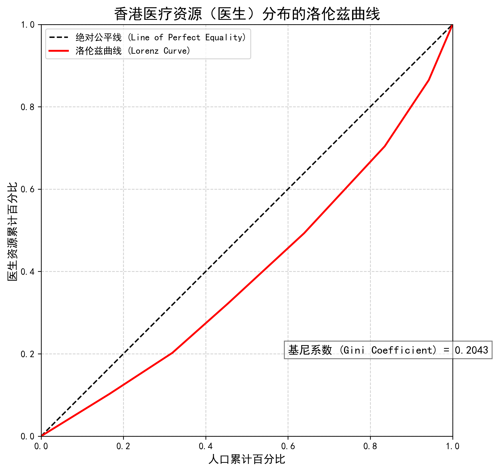

# 大湾区医疗资源空间公平性评估：一项基于POI数据的实证研究

## 成果速览 (Live Demo & Key Findings)

### 1. 深圳市“港澳药械通”政策空间分布 · 在线交互地图

**[>> 点击此处，在线体验交互地图 <<](https://klau-sushi.github.io/GBA-Healthcare-Equity-Analysis/港澳药械通政策空间评估地图_密度热力版.html)**

### 2. 香港医疗资源（医生）分布洛伦兹曲线

---

## 项目说明 (Project Documentation)

项目名称： 双重失衡下的政策回应：基于POI数据的大湾区医疗资源空间公平性评估——以“港澳药械通”为例

数据集整理团队： 岑浣筠 兰安琪 让怡馨

最后更新日期： 2025年9月30日

一、 文件夹结构说明

/Data: 包含所有原始及处理后的数据文件。

/Code: 包含所有用于数据分析与可视化的Python脚本。

/Chart: 包含本研究重要图表。

二、 数据文件说明 (Data Dictionary)

文件: macro_comparison_data.csv

描述: 用于对比深圳、广州、香港三地核心医疗资源的宏观数据（数据年份：2023）。

变量说明:

城市: 城市官方名称（广州市, 深圳市, 香港特别行政区）。

医疗卫生机构总数: 该城市所有医疗卫生机构的总数量。

医院数: 该城市医院的总数量。

专业公共卫生机构数: 该城市专业公共卫生机构的总数量（如疾控中心等）。

卫生技术人员总数: 该城市所有卫生技术人员的总数量。

执业（助理）医师数: 该城市所有执业（助理）医师的总数量。

注册护士数: 该城市所有注册护士的总数量。

医院床位数: 该城市所有医院的床位总数量。

每千人口卫生技术人员数: 以千人为单位，该城市平均拥有的卫生技术人员数量。

每千人口医院床位数: 以千人为单位，该城市平均拥有的医院床位数量。

人口数（单位：千人）: 该城市2023年末的常住人口数量，单位为“千人”。

文件: shenzhen_poi_data.xlsx

描述: 深圳市三甲医院及“港澳药械通”指定医院的POI（兴趣点）数据，用于地图可视化分析。

变量说明:

name: 医院的官方中文全称。

longitude: 医院所在位置的经度坐标（WGS-84坐标系）。

latitude: 医院所在位置的纬度坐标（WGS-84坐标系）。

Adress: 医院的详细地址信息。

行政区划: 医院所属的深圳市行政区划名称（例如：福田区, 龙岗区）。

type: 医院类型分类。

Tier_A_Only: 代表该医院是普通三甲医院。

Policy_Designated: 代表该医院是“港澳药械通”政策指定医院（三甲）。

Non_Tier_A_Policy：代表该医院是“港澳药械通”政策指定医院（非三甲）

文件: anchors.csv
描述: 深圳市主要陆路口岸的地理位置坐标数据。在地图上标示这些“锚点”，旨在直观展示“港澳药械通”指定医院与深港跨境交通枢纽之间的空间邻近关系。

变量说明:

name: 口岸的官方中文名称。

longitude: 口岸所在位置的经度坐标（WGS-84坐标系）。

latitude: 口岸所在位置的纬度坐标（WGS-84坐标系）。

文件: hongkong_gini_data.csv

描述: 用于计算香港医疗资源（医生）分布基尼系数，并绘制洛伦兹曲线的各区域原始数据（数据年份：2023）。

变量说明:

district: 香港的行政区划或区域名称。

population: 该区域2023年末的常住人口数量，单位为“千人”。

num_doctors: 该区域医生总数量。

文件: district_density.csv
描述: 深圳市各行政区内“港澳药械通”政策指定医院的数量统计。该数据为中间处理结果，直接用于生成论文中的区域密度热力图（Choropleth Map）。

变量说明:

district: 深圳市的行政区划官方名称。

count: 在该行政区划内，“港澳药械通”政策指定医院的总数量。

三、 数据来源说明

宏观对比数据: 主要来源于2024年版《广州统计年鉴》、《深圳统计年鉴》、《香港统计年刊》。其中，香港年末人口数据，交叉引用自香港特别行政区政府统计处于2024年2月20日发布的《二零二三年年底人口數字》新闻公报。

深圳POI数据: 通过公开渠道及主流地图API服务采集并交叉验证。

香港各区数据: 来源于香港政府统计处及香港卫生署官方网站。

深圳GeoJSON数据: 来源于权威地理信息数据库。

四、 代码文件说明

policy_map.py: 用于生成深圳市“港澳药械通”政策空间分布及密度热力图。

lorenz_curve.py: 用于计算香港医疗资源分布的基尼系数，并绘制洛伦兹曲线图。

hospital_data.py：运行地图API服务计算出深圳各三甲医院和政策医院的经纬度数据。
